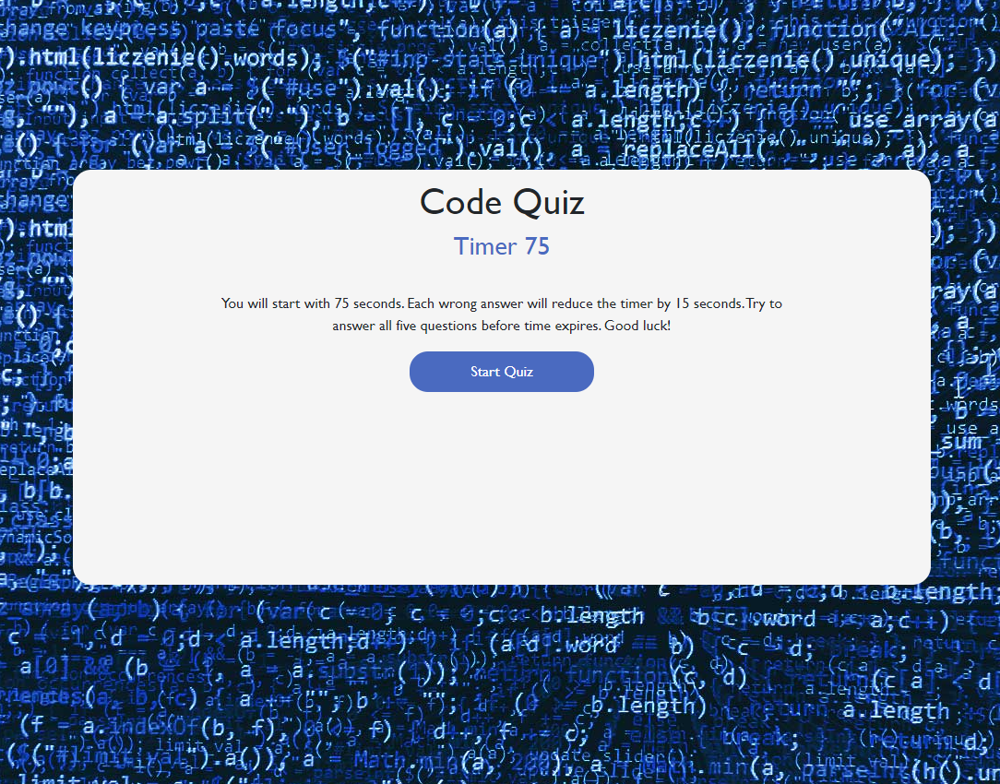

# Code Quiz

## Overview

This coding assessment is a timed coding quiz with multiple-choice questions. This app will run in the browser, and will feature dynamically updated HTML and CSS powered by JavaScript. It has a clean, polished, and responsive user interface.

## User Story

AS A coding boot camp student
I WANT to take a timed quiz on JavaScript fundamentals that stores high scores
SO THAT I can gauge my progress compared to my peers

## URLs

https://esober101.github.io/code-quiz/

## Screenshots

